# Architecture

What lives where, and which way dependencies point. The layer order shown
here is enforced by import-linter, so this picture cannot drift from the
code without that contract failing first.

```mermaid
flowchart TB
    subgraph entry["Entry points (composition root, outside the layers)"]
        CLI["agentless-mcp\n(CLI, works in any directory)"]
        MCP["agentless-mcp-server\n(stdio MCP, allowlisted roots only)"]
        BOOT["bootstrap.py\nwires services, picks token counter"]
        CLI --> BOOT
        MCP --> BOOT
    end

    subgraph adapters["adapters: talk to the outside world"]
        CLIA["cli/main.py\nargument parsing, exit codes"]
        MCPA["mcp/server.py\nthe read tools, root allowlist,\nrefusals, read-only annotations"]
    end

    subgraph application["application: one service per question"]
        MAPS["map_service\nranked, token-budgeted repo map"]
        VIEWS["view_service\ntree, skeletons, slices"]
        SYMS["symbol_service\nfind, expand, refs, shared callers"]
        PATCH["patch_service\nparse, check, apply"]
        VAL["validate_service\nbaseline, candidates, vote"]
        ENV["envelope\nreceipt + untrusted-content banner\non every answer"]
    end

    subgraph core["core: the machinery (no I/O opinions)"]
        EXTRACT["extractor + refs + imports\ntree-sitter parse per file"]
        GRAPH["graph\npersonalized PageRank over references"]
        SKEL["skeleton + slices + locs\nviews at each zoom level"]
        PATCHC["patches + normalize + vote\nSEARCH/REPLACE, AST-equivalence,\nvote ladder"]
        CACHE["cache\nSQLite rows keyed by (path, sha256):\nfresh by construction, never a stale artifact"]
        SBX["sandbox + gitinfo\nthrowaway worktrees, bounded test runs"]
        GRAM["grammars\ndownload only at warmup, never mid-call"]
    end

    subgraph prompts["prompts: every agent-facing string, as data"]
        PJSON["tool_descriptions.json\nenvelope.json / messages.json"]
    end

    subgraph util["util: stdlib-only leaves"]
        FSL["fslimits (path containment, walk bounds)\ntokens (budget estimator)\nfilelock / platforms / errors"]
    end

    BOOT --> adapters
    adapters --> application
    application --> core
    application --> prompts
    core --> prompts
    core --> util
    prompts ~~~ util
```

