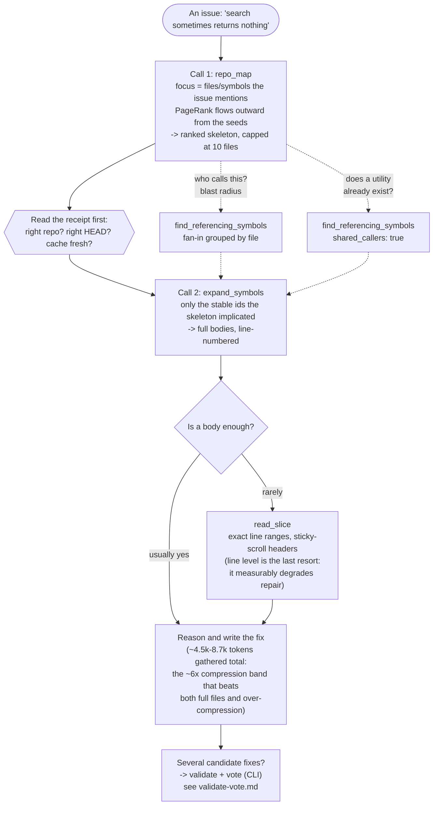

# The localization funnel

The tool from the agent's point of view: two calls answer most questions,
and every arrow downward spends fewer tokens on more relevant code. The
numbers on the nodes are the research constraints the defaults encode.

