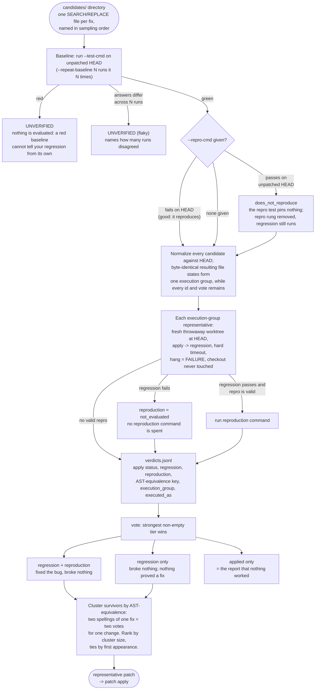

# Patch validation and the vote

The write side, CLI only: several candidate fixes go in, ranked evidence
comes out. The two red outcomes exist so that no verdict is ever computed
against a baseline that could not have told the truth.

